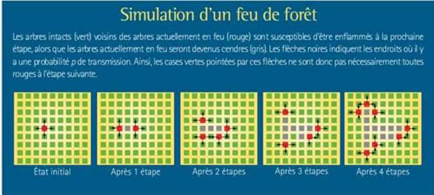
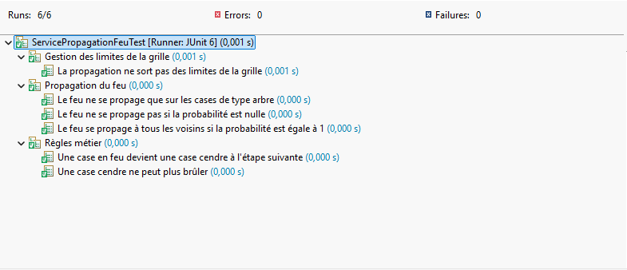

# FeuDeForet - Simulation de propagation d’un feu de forêt

## Objectif

Le but de ce projet est de simuler la propagation d’un feu de forêt sur une grille.

La simulation se fait étape par étape, en respectant des règles simples.

---

## Fonctionnement

La forêt est représentée par une grille (comme un tableau).

Chaque case peut être dans un état :

* `ARBRE` → case normale (peut brûler)  
* `EN_FEU` → case en train de brûler  
* `CENDRE` → case brûlée (ne peut plus brûler)

---

## Règles de la simulation

À chaque étape :

1. Une case en feu devient une cendre  
2. Elle peut enflammer ses voisins :
   * en haut
   * en bas
   * à gauche
   * à droite  
3. Le feu se propage avec une probabilité (ex : 0.3)  
4. Une case en cendre ne change plus  
5. La propagation ne sort pas des limites de la grille  

---

## Point important

Toutes les cases évoluent en même temps.

Pour gérer ça, on utilise une copie de la grille :

* on lit l’état actuel  
* on écrit dans une nouvelle grille  

Cela évite des erreurs de propagation.

---

## Configuration (Spring Boot)

Les paramètres sont définis dans un fichier `application.yml`.

Exemple :

```yaml
simulation:
  largeur: 10
  hauteur: 10
  probabilite: 0.3
  feuxInitiaux:
    - [5, 5]
    - [2, 3]
```

## Lancer le projet

Avec Maven :

```yaml
mvn clean install 
mvn spring-boot:run
```

Ou directement depuis l’IDE en lançant la classe FeudeforetApplication.

## Exemple de sortie

```yaml
Étape : 0 
.......... 
.....F.... 
.......... 

Étape : 1 
.....F.... 
....FXF... 
.....F....
```

## Structure du projet


```yaml
domaine/ 
  modele/              → Foret, EtatCase 
  service/             → logique du feu 

application/           → gestion de la simulation 

infrastructure/        → affichage, random 

config/                → configuration Spring
```

## Points importants du projet
- code simple et lisible
- séparation des responsabilités
- logique métier testée
- configuration externe

## Tests unitaires

Les tests sont faits avec JUnit.

Ils permettent de vérifier que les règles du feu sont bien respectées.



## Ce qui est testé

### 1. Transformation du feu

Une case en feu devient une cendre.

On vérifie que le comportement est correct après une étape.

### 2. Pas de propagation (probabilité = 0)

Si la probabilité est 0 :

le feu ne doit jamais se propager.

### 3. Propagation maximale (probabilité = 1)

Si la probabilité est 1 :

tous les voisins doivent brûler.

### 4. Cas des cendres

une case cendre ne peut jamais reprendre feu.

### 5. Bords de la grille

le programme ne doit pas planter quand on est sur les bords.

## Gestion du hasard dans les tests

Pour tester correctement, on ne peut pas utiliser un vrai Random.

On utilise un faux générateur :

qui retourne toujours la même valeur
ce qui rend les tests prévisibles

Exemple :

valeur = 0.1 → le feu se propage \
valeur = 0.9 → le feu ne se propage pas


## Améliorations possibles

- interface graphique (Angular)
- API REST
- Gestion des déplacements sur les axes vertical (haut/bas) et horizontal (gauche/droite)
  
## Auteur

ATTARIK Youssef

[def]: ../../Downloads/TU.png